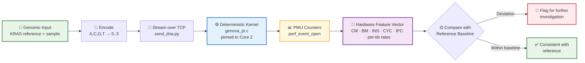

<div align="center">

# 🧬 GENOVA

### **GEN**omics × Computer Architecture × Edge Computing

*What if the CPU processing the DNA could tell us something about the DNA?*


</div>

---

## 📌 Table of Contents

1. [Motivation](#-motivation)
2. [The Idea](#-the-idea)
3. [Project Workflow](#-project-workflow)
4. [System Architecture](#-system-architecture)
5. [Project Architecture (Repository)](#-project-architecture-repository)
6. [The Deterministic Kernel (`genova_pi.c`)](#-the-deterministic-kernel-genova_pic)
7. [The DNA Sender (`send_dna.py`)](#-the-dna-sender-send_dnapy)
8. [PMU Signature & Hardware Feature Vector](#-pmu-signature--hardware-feature-vector)
9. [Wire Protocol](#-wire-protocol)
10. [Quick Start](#-quick-start)
11. [Experiment: Controlled KRAS Mutation Sweep](#-experiment-controlled-kras-mutation-sweep)
12. [What GENOVA Is — and Is Not](#-what-genova-is--and-is-not)
13. [Roadmap](#-roadmap)
14. [Limitations & Honest Notes](#-limitations--honest-notes)

---

## 🎯 Motivation

Cancer is not only a disease of biology — it is also a **race against time**.

Some cancer-associated genomic changes can be very small, yet identifying meaningful changes early can be extremely important: the earlier an abnormality is found, the more opportunity there may be for further investigation and treatment.

Genomic analysis today is computationally intensive and involves multiple stages of testing. This raised our question:

> **Can we use the computer itself to extract another signal from genomic data?**

---

## 💡 The Idea

Instead of treating the CPU as *just a machine that processes DNA*, GENOVA observes **how the CPU behaves while processing DNA**.

1. Genomic data is passed through a **controlled, deterministic genomic-processing kernel** written in C.
2. The workload runs on a **Raspberry Pi CPU** (pinned to a single core).
3. The CPU's **Performance Monitoring Unit (PMU)** measures low-level hardware behaviour:
   cache misses · branch mispredictions · instructions · CPU cycles · IPC **(PMU SIGNATURE)**
4. These measurements become a **hardware feature**, compared against a **reference baseline**.
5. **Detecting Cancer Associated DNA Processing Patterns Through CPU Hardware Signatures**

In our controlled **KRAS** experiment we start from a reference sequence and deliberately introduce controlled sequence changes. As the input changes, the CPU's **microarchitectural behaviour changes with it**.

> ⚠️ This does **not** mean a particular cache-miss value means cancer.
> It demonstrates something more fundamental: **a change in genomic input can produce a measurable change in CPU behaviour under a controlled workload.**

---

## 🔄 Project Workflow



### Step-by-step

| # | Stage | What happens |
|---|-------|--------------|
| 1 | **Prepare** | Build reference & sample sequences (`make_kras_mut.py`, `make_classes.py`) → `.bin` files |
| 2 | **Stream** | `send_dna.py` sends reference + sample chunk pairs to the Pi over TCP |
| 3 | **Process** | `genova_pi.c` runs a pairwise ref-vs-sample comparator on core 2 |
| 4 | **Measure** | PMU counters are enabled for the whole session and read at the end |
| 5 | **Featurize** | Raw counts → normalized features (IPC, misses per 1000 bases, mismatch %) |
| 6 | **Compare** | Feature vector vs. baseline → deviation signature |

---

## 🏗️ System Architecture

```mermaid
flowchart TB
    subgraph HOST["💻 Host Machine (Sender)"]
        direction TB
        H1[kras_ref.fasta]
        H2[make_kras_mut.py<br/>make_classes.py]
        H3[(.bin datasets<br/>reference / mut0.0001 … mut0.1<br/>low / medium / high)]
        H4[send_dna.py<br/>chunked TCP client]
        H1 --> H2 --> H3 --> H4
    end

    subgraph NET["🌐 Network"]
        N1[TCP :9999<br/>4-byte LE length header<br/>+ ref chunk + sample chunk]
    end

    subgraph PI["🍓 Raspberry Pi (Edge Node)"]
        direction TB
        subgraph USER["User Space"]
            P1[Socket Server<br/>recv loop]
            P2[Aligned Buffers<br/>ref_buf · sam_buf<br/>64-byte aligned, 1 MiB]
            P3[⚙️ process_pairwise&#40;&#41;<br/>deterministic kernel]
            P4[chaos&#40;&#41;<br/>branch + memory stressor<br/>16 MiB buffer]
            P1 --> P2 --> P3
            P3 -- mismatch --> P4
        end
        subgraph KERNEL["Kernel / Hardware"]
            K1[perf_event_open syscall]
            K2[🔬 ARM PMU<br/>cache-misses · branch-misses<br/>instructions · cycles]
        end
        P3 -.executes on.-> K2
        K2 --> K1
        K1 --> P5[Feature Vector<br/>+ ground-truth mismatch %]
    end

    OUT[📄 Result line<br/>bases · mismatch · cm · bm · ic · cy · ipc<br/>cm_per_kb · bm_per_kb]

    H4 ==> N1 ==> P1
    P5 ==> OUT

    style HOST fill:#e8f5e9,stroke:#2e7d32
    style PI fill:#fce4ec,stroke:#ad1457
    style NET fill:#e3f2fd,stroke:#1565c0
```



### Layered view

```
┌──────────────────────────────────────────────────────────────┐
│  Application   │ Genomic comparator + feature extraction     │
├──────────────────────────────────────────────────────────────┤
│  Workload      │ Controlled deterministic C kernel           │
├──────────────────────────────────────────────────────────────┤
│  OS            │ Linux · perf_event_open · CPU affinity      │
├──────────────────────────────────────────────────────────────┤
│  Hardware      │ ARM CPU core 2 · L1/L2/L3 caches · branch   │
│                │ predictor · PMU counters                    │
└──────────────────────────────────────────────────────────────┘
```

---

## 📁 Project Architecture (Repository)

```
genova/
├── genova_pi.c            # ⚙️  Deterministic kernel + PMU telemetry (runs on Pi)
├── send_dna.py            # 📡  Sender: streams ref/sample pairs over TCP
├── make_kras_mut.py       # 🧪  Generates KRAS mutation-rate datasets
├── make_classes.py        # 🧪  Generates low / medium / high classes
├── kras_ref.fasta         # 🧬  KRAS reference sequence (FASTA)
├── kras_reference.bin     # 🧬  Encoded reference (0..3 per base)
│
├── kras_mut0.0001.bin     # Mutation sweep (percent values)
├── kras_mut0.001.bin
├── kras_mut0.005.bin
├── kras_mut0.01.bin
├── kras_mut0.05.bin
├── kras_mut0.1.bin
│
├── kras_low.bin           # Class datasets
├── kras_medium.bin
├── kras_high.bin
└── README.md
```

---

## ⚙️ The Deterministic Kernel (`genova_pi.c`)

> **GENOVA's kernel is a *controlled, deterministic* genomic-processing kernel written in C.**
> Given the same input, it executes the same instruction path every time. Any change in hardware behaviour therefore comes from the **input data**, not from non-deterministic software.

### Design properties

| Property | Implementation |
|----------|----------------|
| **Determinism** | Fixed LCG constants, fixed seeds, no `rand()` in the kernel, no dynamic branching on external state |
| **Isolation** | Pinned to **CPU core 2** via `sched_setaffinity` |
| **Clean measurement** | `exclude_kernel = 1`, `exclude_hv = 1` → user-space only counting |
| **Alignment** | `posix_memalign` with 64-byte (cache-line) alignment |
| **Whole-session counting** | Counters reset + enabled once, disabled after the final chunk |
| **Ground truth** | Software mismatch counter independently verifies the true mismatch count |

### Core algorithm — pairwise reference-vs-sample comparator

```
for each base i:
    diff = ref[i] XOR sample[i]
    if diff == 0:   → MATCH     : cheap, predictable path (acc += 1)
    else:           → MISMATCH  : call chaos(), a data-dependent
                                  branch + memory stress routine
```

- **Match** → predictable branch, minimal cost.
- **Mismatch** → diverges to a heavier path. The *positions and density* of mismatches shape cache and branch behaviour.

### The `chaos()` amplifier (per mismatch)

| Parameter | Value | Purpose |
|-----------|-------|---------|
| `CHAOS_BRANCHES` | **64** | Data-dependent branches → ~64 potential branch mispredicts per mismatch |
| `CHAOS_MEMS` | **8** | Pseudo-random reads → ~8 potential cache misses per mismatch |
| `BOMB_BITS` | **24** | 16 MiB buffer — larger than L3, smaller than RAM |
| `BOMB_SIZE` | `1 << 24` | Forces genuine cache-miss traffic |
| LCG multiplier | `6364136223846793005` | 64-bit deterministic pseudo-random sequence |
| Hash multiplier | `2654435761` | Knuth multiplicative hash for memory index |

### Kernel configuration constants

| Constant | Value | Meaning |
|----------|-------|---------|
| `PORT` | `9999` | TCP listening port |
| `BUF_SIZE` | `1 << 20` (1 MiB) | Max chunk size accepted |
| `LUT_BITS` / `LUT_SIZE` | `18` / `262144` | Look-up table (allocated; no longer used by the comparator) |
| CPU pin | `core 2` | Isolated measurement core |

---

## 📡 The DNA Sender (`send_dna.py`)

```bash
python3 send_dna.py <PI_IP> <healthy|mutX|allA|file.bin> [N]
```

| Mode | Description |
|------|-------------|
| `healthy` | Reference == sample (0% mismatch) → **baseline** |
| `mutX` | Random point substitutions at **X %** (e.g. `mut0.01` = 0.01 %). Fixed seeds → reproducible |
| `allA` | Sample is all `A` (0) vs. random reference → worst-case divergence |
| `*.bin` | Sample loaded from file (e.g. KRAS datasets) and compared against `kras_reference.bin` |

| Parameter | Default | Notes |
|-----------|---------|-------|
| `N` | `5,000,000` | Number of bases (synthetic modes) |
| `CHUNK` | `65536` | Bases per chunk |
| Base encoding | `0..3` | A / C / G / T as one byte each |
| Seeds | `42` (sequence), `12345` (mutation positions) | Reproducibility |
| Connection | Retry for up to 60 s | Sender waits for the Pi to start listening |

---

## 🔬 PMU Signature & Hardware Feature Vector

### Raw counters (measured today)

| Counter | Linux event | What it tells us |
|---------|-------------|------------------|
| **Cache misses** (`cm`) | `PERF_COUNT_HW_CACHE_MISSES` | Memory-system pressure |
| **Branch mispredictions** (`bm`) | `PERF_COUNT_HW_BRANCH_MISSES` | Control-flow irregularity |
| **Instructions** (`ic`) | `PERF_COUNT_HW_INSTRUCTIONS` | Work retired |
| **CPU cycles** (`cy`) | `PERF_COUNT_HW_CPU_CYCLES` | Time cost |

### Derived parameters (computed today)

| Feature | Formula | Meaning |
|---------|---------|---------|
| **IPC** | `instructions / cycles` | Pipeline efficiency |
| **cm_per_kb** | `1000 × cache_misses / bases` | Cache misses per 1000 bases |
| **bm_per_kb** | `1000 × branch_misses / bases` | Branch mispredicts per 1000 bases |
| **mismatch %** | `100 × mismatches / bases` | Software ground truth |
| **bases** | total bases processed | Normalization denominator |

### Extended parameters (proposed for the feature vector)

| Feature | Formula | Why it helps |
|---------|---------|--------------|
| **CPI** | `cycles / instructions` | Inverse of IPC; cost per instruction |
| **Instructions per base** | `instructions / bases` | Work-per-base scaling |
| **Cycles per base** | `cycles / bases` | Time-per-base scaling |
| **Cache-miss rate** | `cache_misses / instructions` | Memory-boundedness |
| **Branch-miss rate** | `branch_misses / instructions` | Control-flow boundedness |
| **Δ vs. baseline (absolute)** | `feature − baseline` | Direct deviation |
| **Δ vs. baseline (relative %)** | `100 × (feature − baseline) / baseline` | Scale-free deviation |
| **Misses per mismatch** | `Δcache_misses / mismatches` | Marginal hardware cost of one variant |
| **Branch-miss per mismatch** | `Δbranch_misses / mismatches` | Marginal control-flow cost of one variant |
| **Z-score vs. baseline** | `(x − μ) / σ` (over repeated runs) | Statistical significance |
| *(optional)* L1D / LLC / dTLB misses, stalled cycles | extra PMU events | Richer signature |
| *(optional)* wall time, CPU temperature | system sensors | Environmental control |

### Signature as a vector

```
V = [ IPC, cm_per_kb, bm_per_kb, CPI, ins/base, cyc/base, cm/ins, bm/ins ]

Signature = V_sample − V_baseline
```

### Output format

```
bases=5000000 mismatch=500 (0.010%) cm=... bm=... ic=... cy=... ipc=... cm_per_kb=... bm_per_kb=...
```

---

## 🔌 Wire Protocol

```
┌──────────────┬───────────────────┬───────────────────┐
│ 4 bytes (LE)│  n bytes          │  n bytes          │
│ chunk length│  reference chunk  │  sample chunk     │
└──────────────┴───────────────────┴───────────────────┘
        ⟲ repeated per chunk (≤ 1 MiB each)

        0x00000000  →  end-of-stream sentinel
```

---

## 🚀 Quick Start

### 1. On the Raspberry Pi — build & run

```bash
gcc -O2 -o genova_pi genova_pi.c

# perf_event_open may need relaxed permissions or root
sudo sysctl -w kernel.perf_event_paranoid=1

./genova_pi
# listening on 9999 [pairwise ref-vs-sample], LUT=262144 entries, pinned to core 2
```

### 2. On the host — send data

```bash
# Baseline: identical sequences
python3 send_dna.py <PI_IP> healthy

# Controlled mutation: 0.01% substitutions
python3 send_dna.py <PI_IP> mut0.01

# Worst case
python3 send_dna.py <PI_IP> allA

# KRAS dataset file
python3 send_dna.py <PI_IP> kras_mut0.01.bin
```

### 3. Read the signature

The Pi prints one summary line when the stream ends. Restart `genova_pi` before each run (it serves one session).

---

## 🧪 Experiment: Controlled KRAS Mutation Sweep

| Dataset | Mutation level |
|---------|----------------|
| `kras_reference.bin` | Baseline (0 %) |
| `kras_mut0.0001.bin` | 0.0001 % |
| `kras_mut0.001.bin` | 0.001 % |
| `kras_mut0.005.bin` | 0.005 % |
| `kras_mut0.01.bin` | 0.01 % |
| `kras_mut0.05.bin` | 0.05 % |
| `kras_mut0.1.bin` | 0.1 % |
| `kras_low / medium / high.bin` | Class-based datasets |

**Procedure:** run each dataset through the identical pipeline → record feature vector → plot features vs. mutation rate → compare to baseline. Repeat runs for variance estimates.


---

## ✅ What GENOVA Is — and Is Not

| GENOVA **is** | GENOVA is **not** |
|---------------|-------------------|
| A research prototype exploring hardware-level side-signals of genomic data | A diagnostic tool |
| A potential fast **screening / triage layer** for research environments | A replacement for biopsy, sequencing, or clinical diagnosis |
| A study of input-dependent microarchitectural behaviour | A claim that a cache-miss value "means cancer" |
| An edge-computing friendly approach (Raspberry Pi) | Validated on real tumour data (yet) |

> We are not trying to replace existing diagnosis.
> **We are asking a different question: what if the CPU processing the DNA can itself provide an additional signal about what is happening in that genomic workload?**

---

## 🗺️ Roadmap

- [x] Deterministic C kernel with PMU telemetry on Raspberry Pi
- [x] TCP streaming pipeline (host → edge)
- [x] Controlled KRAS mutation sweep (0.0001 % → 0.1 %)
- [ ] Repeated runs with statistics (mean, σ, confidence intervals)
- [ ] Expanded PMU feature set (L1D, LLC, dTLB, stalled cycles)
- [ ] Real **tumour vs. normal** genomic datasets through the same pipeline
- [ ] Classifier on hardware feature vectors (threshold → ML)
- [ ] Cross-hardware validation (different Pi models / ARM CPUs)
- [ ] Integration as a triage layer alongside existing genomic workflows

---

## ⚠️ Limitations & Honest Notes

- **Synthetic amplification.** `chaos()` deliberately amplifies mismatch-driven branch and cache behaviour so differences are measurable. The signal comes from a *controlled, engineered workload*; its biological relevance on real data remains to be shown.
- **Reference-aware.** The kernel compares a sample against a reference. The signature reflects *divergence from the reference*, which can be computed in software directly; the open question is whether the hardware signature adds information or robustness beyond that.
- **Naming.** `cm_per_kb` / `bm_per_kb` are computed per **1000 bases**.
- **Noise.** PMU counts vary with temperature, frequency scaling, and background load. Repeated runs, fixed governors, and an isolated core are recommended.
- **Single-session server.** `genova_pi` handles one connection and exits.
- **`send_dna.py` `.bin` mode** pairs the loaded file (sample) with `kras_reference.bin` (reference), and the two must be the same length.
- **Research use only.** Not for clinical decision-making.

---

<div align="center">

**Because in cancer research, every improvement in how quickly we can identify a potentially abnormal signal can create an opportunity to investigate it sooner.**

🧬 *GENOVA — Genomics × Computer Architecture × Edge Computing* 🍓

</div>
